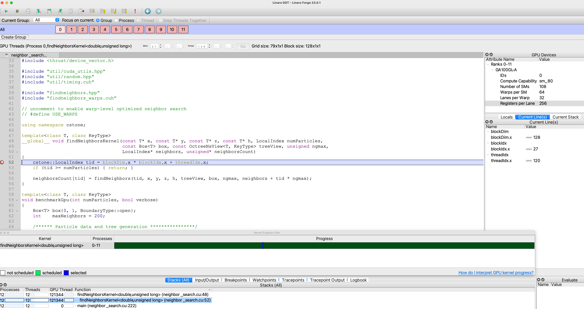

# Linaro Forge (DDT) debugger

https://www.linaroforge.com/downloadForge

Linaro Forge (formerly known as DDT) allows source-level debugging of Fortran, C, C++ and Python codes. It can be used for debugging serial, multi-threaded (OpenMP), multi-process (MPI) and accelerated (Cuda, OpenACC) programs running on research and production systems, including CSCS Alps system. It can be executed either as a graphical user interface or from the command-line.

## Using the debugger

In order to debug your code on Alps, you need to:

- setup the user environment on Alps,
- install the DDT client on your laptop,
- build an executable with debug flags on Alps,
- launch a job with the debugger on Alps.

### Setup the environment

`gcc113-mpich8125-cuda118-forge2301.squashfs` provides the latest version of Linaro Forge (23.0.1), along with gcc/11.3, cray-mpich-8.1.25 and cuda/11.8.

- On Alps:
```bash
uenv start ./gcc113-mpich8125-cuda118-forge2301.squashfs
ls -l /user-environment/
source /user-environment/env/default/activate.sh
```

### Install the client

We recommend to download and install the desktop [client](https://www.linaroforge.com/downloadForge) on your local workstation. It will connect with the debug jobs running on Alps, offering a better user experience compared to opening ddt with X11 forwarding. The client can be downloaded for a selection of operating systems.

Once installed, the client needs to be configured to connect to your preferred vcluster. For this, launch the client:

```
- mac: open /Applications/Linaro\ Forge\ Client\ 23.0.1.app/
- linux: $HOME/linaro/forge/23.0.1/bin/ddt
```

and setup the connection:

```
- open the 'Remote Launch' menu and click on 'configure' and then 'Add',
- set the fields, for example:
    - Connection Name: alps
    - Host Name: piccinal@ela.cscs.ch piccinal@hohgant.cscs.ch
      # replace piccinal with your CSCS username
    - Remote install dir: /usr/bin/squashfs-run IMG DDTDIR
      # here we tell the client to use the ddt installed in the uenv image
    - Remote Script:
    - Private Key: /Users/piccinal/.ssh/cscs-key
      # replace /Users/piccinal with your laptop username
    - Proxy through login node: yes (check the box)
```

where you will replace IMG and DDTDIR with for example:
```
- IMG is /scratch/e1000/piccinal/hohgant/octree/gcc113-mpich8125-forge2301.squashfs
- DDTDIR is /user-environment/linux-sles15-zen2/gcc-11.3.0/ddt-23.0.1-qobm4ghhupq4ueij3kkdtzozd5qevjpl
```

Click `Test Remote Launch`. If the client can connect, you are ready to debug:
click on `ok` and `close` (to save the configuration). You can now connect by going to `Remote Launch` and choose the `Alps` entry. If the client fails to connect, look at the message, check your ssh configuration and make sure you can ssh without the client.

### Build with debug flags

Once the uenv is loaded and activated, the program to debug must be compiled with the `-g` (for cpu) and `-G` (for gpu) debugging flags. For example, download the example code:

- on Alps:
```bash
git clone https://github.com/sekelle/octree-miniapp octree-miniapp.git
wget https://raw.githubusercontent.com/jgphpc/octree-miniapp/ddt/neighbor_search.patch
cd octree-miniapp.git
patch -i neighbor_search.patch
cd ..
```

build the code with:
 
- on Alps:
```bash
ii=`mpicc -compile-info |tr " " "\n" |grep "^-I"`

nvcc -g -G -arch=sm_80 \
-forward-unknown-to-host-compiler -std=c++17 $ii \
-c -x cu octree-miniapp.git/neighbor_search.cu -w
```

link the code with:
- on Alps:
```bash
mpicc -w -g -std=c++17 neighbor_search.o \
-lstdc++ -lm \
-L/user-environment/env/default/lib64 -lcudart \
-L/user-environment/env/default/lib64/stubs -lnvidia-ml \
-Wl,-rpath=/user-environment/env/default/lib64 \
-Wl,-rpath=/user-environment/env/default/lib64/stubs
```

### Launch the debugger

Given the unusual way of loading the uenv, the DDT client must be launched in `Manual Launch` mode (assuming that it is connected to Alps via `Remote Launch`):

- on the client:
```
- open the 'Manual Launch' menu and
- set the fields, for example:
    - Number of processes: 12
    - CUDA: yes (check the box for gpu exeutables)
    - Memory Debugging: yes (check the box for memory debugging)
```
Listen and wait 

You can then launch ddt with the srun command (or a Slurm jobscript):

- on Alps:
```bash
OMP_NUM_THREADS=1 \
srun --uenv-file=./gcc113-mpich8125-cuda118-forge2301.squashfs \
-p nvgpu -n12 -N3 -t10 -c16 --cpu-bind=none ./cuda_visible_devices.sh \
/user-environment/env/default/bin/forge-client ./a.out
```

The client should look like this:


